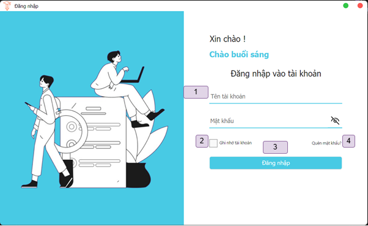

# Phần mềm Quản lý Học sinh

Ứng dụng quản lý học sinh dành cho các trường học từ cấp 3 trở xuống, hỗ trợ quản lý thông tin học sinh, giáo viên, lớp học, điểm số, và báo cáo học tập.

## 1. Thành viên thực hiện

| STT | MSSV     | Họ và tên              | Lớp       |
|-----|----------|------------------------|-----------|
| 1   | 22520187 | Bùi Khánh Đang         | SE104.O24 |
| 2   | 22520190 | Nguyễn Lưu Minh Đăng   | SE104.O24 |
| 3   | 22520098 | Đặng Quốc Bảo          | SE104.O24 |
| 4   | 22520090 | Mai Thanh Bách         | SE104.O24 |
| 5   | 22520091 | Nguyễn Hoàng Bách      | SE104.O24 |

## 2. Mục đích và lý do chọn đề tài

### Mục đích
- Xây dựng hệ thống quản lý toàn diện cho trường học, bao gồm quản lý học sinh, giáo viên, lớp học, điểm số, và báo cáo.
- Thay thế phương pháp quản lý thủ công bằng Excel/giấy tờ, tăng độ chính xác và bảo mật.
- Cung cấp giao diện trực quan, dễ sử dụng cho quản trị viên, giáo viên và học sinh.

### Lý do chọn đề tài
- Số lượng học sinh tăng nhanh, việc quản lý thủ công trở nên phức tạp và dễ sai sót.
- Nhu cầu số hóa quy trình quản lý trong giáo dục ngày càng cao.

## 3. Chức năng chính
- **Quản lý học sinh**: Thêm, xóa, sửa thông tin, xếp lớp.
- **Quản lý giáo viên**: Phân công giảng dạy, cập nhật thông tin.
- **Quản lý lớp học**: Tạo lớp, quản lý sĩ số, thời khóa biểu.
- **Quản lý điểm số**: Nhập điểm, tính điểm trung bình, xếp loại.
- **Báo cáo**: Thống kê kết quả học kỳ, môn học, xuất file Excel.
- **Phân quyền**: Đăng nhập với vai trò quản trị viên, giáo viên, học sinh.
- **Hỗ trợ**: Quên mật khẩu, đổi mật khẩu, cập nhật thông tin cá nhân.

## 4. Công nghệ sử dụng
- **Nền tảng**: .NET Framework, Avalonia UI
- **Frontend**: C#, XAML
- **Backend**: Entity Framework, SQL Server
- **ORM**: ADO.NET Entity Framework
- **Thư viện**: MaterialDesignXAML, SfChart, ExcelDataReader
- **Công cụ**: Visual Studio 2022, GitHub, Miro (thiết kế UI)

## 5. Hướng dẫn sử dụng

  
Đăng nhập

|             |
| :-----------------------------------------: |
| _Màn hình đăng nhập_ |	

1. Nhập thông tin.
2. Ghi nhớ đăng nhập.
3. Đăng nhập.
4. Chuyển sang trang quên mật khẩu.

