# Student Management Software

A student management application for schools from high school level downwards, supporting the management of student information, teachers, classes, scores, and academic reports.

## 1. Team Members

| No. | Student ID | Full Name               | Class      |
|-----|------------|-------------------------|------------|
| 1   | 22520190   | **Nguyễn Lưu Minh Đăng (leader)**    | SE104.O24  |
| 2   | 22520187   | Bùi Khánh Đang          | SE104.O24  |
| 3   | 22520098   | Đặng Quốc Bảo           | SE104.O24  |
| 4   | 22520090   | Mai Thanh Bách          | SE104.O24  |
| 5   | 22520091   | Nguyễn Hoàng Bách       | SE104.O24  |

## 2. Purpose and Reasons for Choosing the Topic

### Purpose
- Build a comprehensive school management system, including student, teacher, class, score, and report management.
- Replace manual management methods using Excel/paperwork to improve accuracy and security.
- Provide an intuitive and user-friendly interface for administrators, teachers, and students.

### Reasons for Choosing the Topic
- Rapidly increasing student numbers make manual management complex and error-prone.
- Growing demand for digitizing educational management processes.

## 3. Key Features
- **Student Management**: Add, delete, edit information, and assign classes.
- **Teacher Management**: Assign teaching responsibilities, update information.
- **Class Management**: Create classes, manage student numbers, and timetables.
- **Score Management**: Input scores, calculate averages, and classify academic performance.
- **Reporting**: Statistical reports for semesters/subjects, export to Excel.
- **Authorization**: Role-based login (administrator, teacher, student).
- **Support**: Password recovery, password change, and personal information updates.

## 4. Technologies Used
- **Platform**: .NET Framework, Avalonia UI
- **Frontend**: C#, XAML
- **Backend**: Entity Framework, SQL Server
- **Libraries**: MaterialDesignXAML, SfChart, ExcelDataReader
- **Tools**: Visual Studio 2022, GitHub, Miro (UI design)

## 5. User Guide

  
Login

|  |
| :---------------------------: |
| _Login Screen_ |

1. Enter credentials.
2. Remember login.
3. Login.
4. Navigate to password recovery.

  
Password Recovery

| 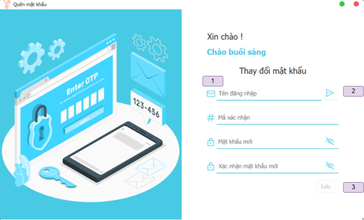 |
| :------------------------------------: |
| _Password Recovery Screen_ |

1. Enter information.
2. Send verification code via email.
3. Save new password.

  
Edit Personal Information

| 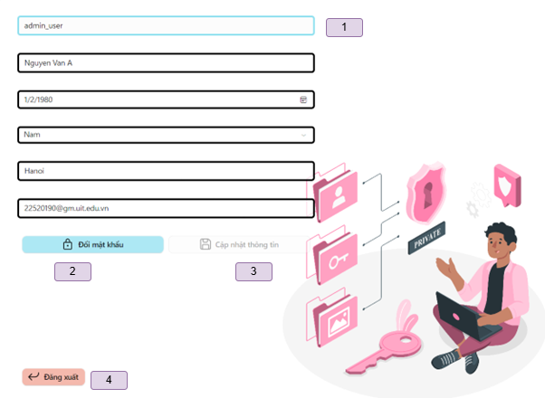 |
| :----------------------------------: |
| _Personal Information Screen_ |

1. Enter information.
2. Open password change screen.
3. Save edited information.
4. Logout.

  
Change Password

| 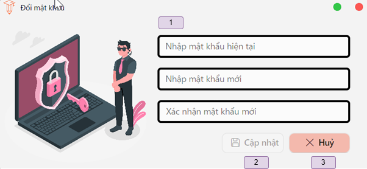 |
| :----------------------------------: |
| _Personal Information Screen_ |

1. Enter information.
2. Save.
3. Cancel.

  
Home Screen for Administrators/Teachers

| 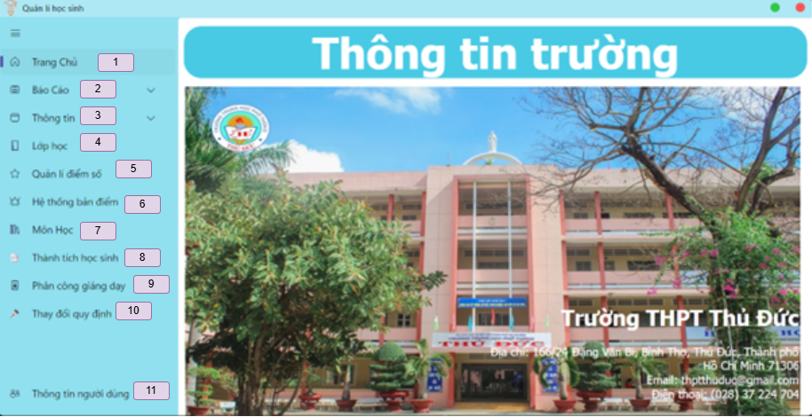 | 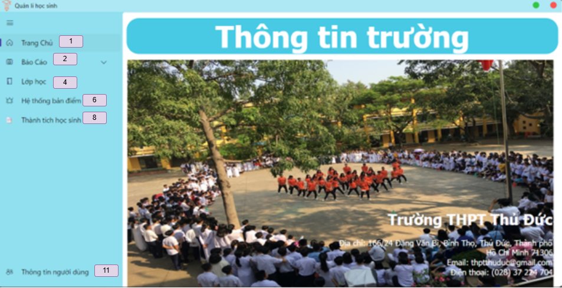 |
| :--------------------------------: | :----------------------------------: |
| _Administrator Home Screen_        | _Teacher Home Screen_ |

1. Display home screen.
2. Display reports.
3. Display information.
4. Display class management.
5. Display score management.
6. Display scoreboard system.
7. Display subject management.
8. Display student achievements.
9. Display teaching assignments.
10. Display regulation changes.
11. Display personal information.

  
Semester/Subject Grade Reports

| 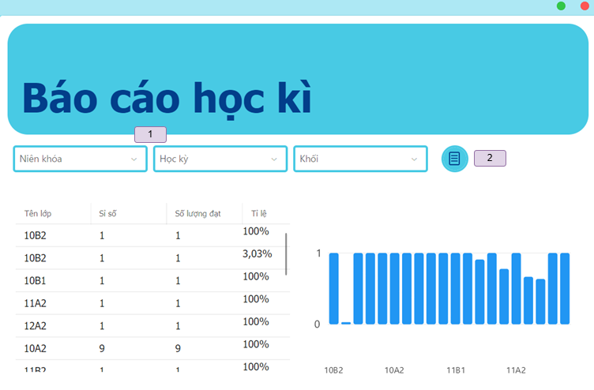 | 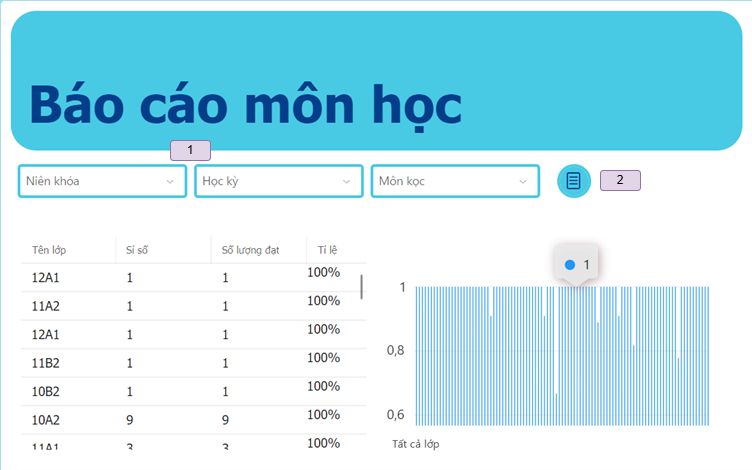 |
| :--------------------------------: | :----------------------------------: |
| _Semester Grade Report Screen_        | _Subject Grade Report Screen_ |

1. Filter combobox.
2. Show all.

  
Teachers Managment

| 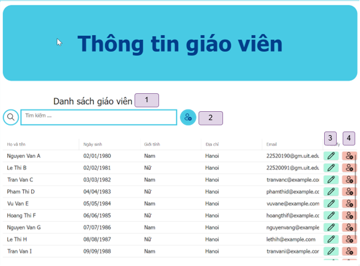 |
| :----------------------------------: |
| _Teachers Managment Screen_ |

1. Search teacher.
2. Open add teacher screen.
3. Open edit teacher screen.
4. Remove teacher.

  
Add/Edit Teacher Information

| 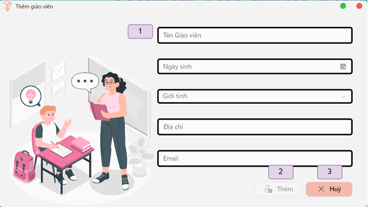 |  |
| :--------------------------------: | :----------------------------------: |
| _Add Teacher Screen_        | _Edit Teacher Screen_ |

1. Enter/Edit information.
2. Save.
3. Cancel.

  
Students Managment

| 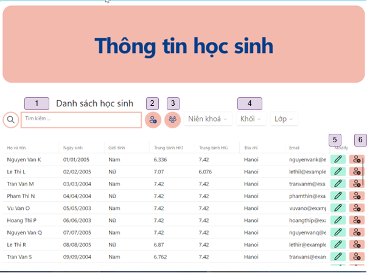 |
| :----------------------------------: |
| _Students Managment Screen_ |

1. Search student.
2. Open add student screen.
3. Show all student.
4. Filter combobox.
5. Open edit student screen.
6. Remove student.

  
Add/Edit Student Information

| 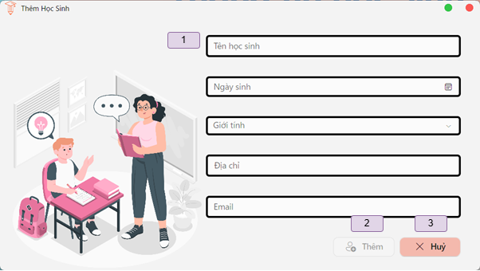 | 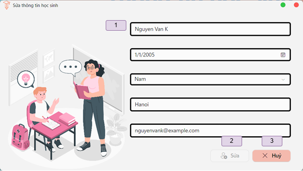 |
| :--------------------------------: | :----------------------------------: |
| _Add Student Screen_        | _Edit Student Screen_ |

1. Enter/Edit information.
2. Save.
3. Cancel.

  
Classes management

| 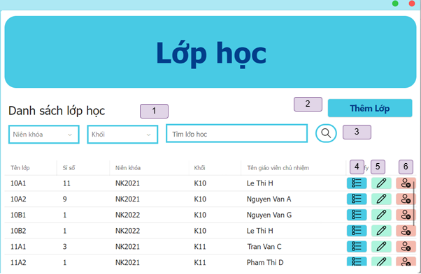 |
| :----------------------------------: |
| _Classes Management Screen_ |

1. Filter combobox.
2. Open add class screen.
3. Search class name.
4. Open students in class screen.
5. Open edit class screen.
6. Remove class.

  
Add/Edit Screen for Class

| 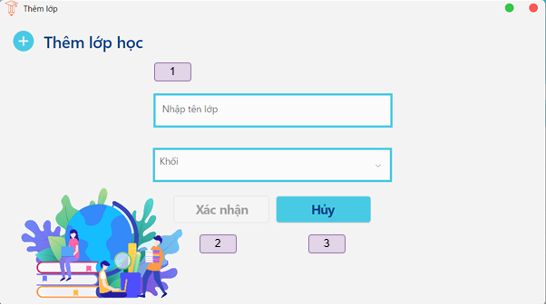 | 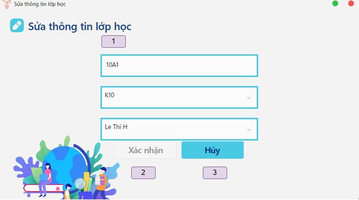 |
| :--------------------------------: | :----------------------------------: |
| _Add Class Screen_        | _Edit Class Screen_ |

1. Enter/Edit information.
2. Save.
3. Cancel.

  
Class Management

| 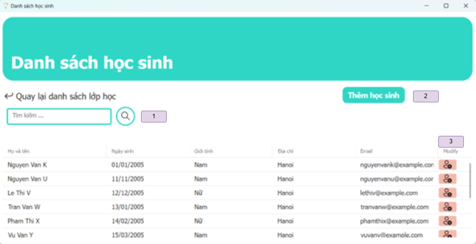 |
| :----------------------------------: |
| _Class Management Screen_ |

1. Search student in class.
2. Open add student to class screen.
3. Remove student from class. 

  
Add Student to Class

| 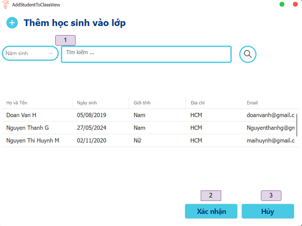 |
| :----------------------------------: |
| _Add Student To Class Screen_ |

1. Search student.
2. Save/Confirm add student.
3. Cancel.

  
Score Management

| 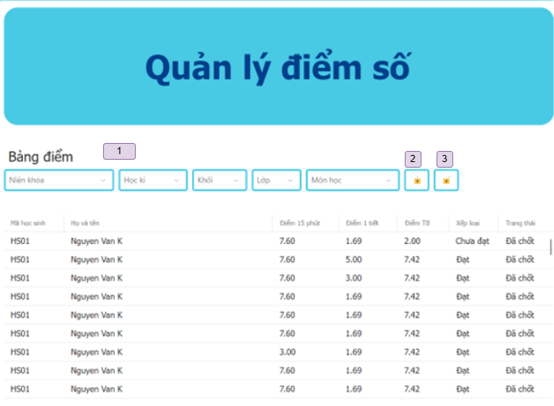 |
| :----------------------------------: |
| _Score Management Screen_ |

1. Filter combobox.
2. Lock scoreboard.
3. Unlock scoreboard.

  
Score System Management

| 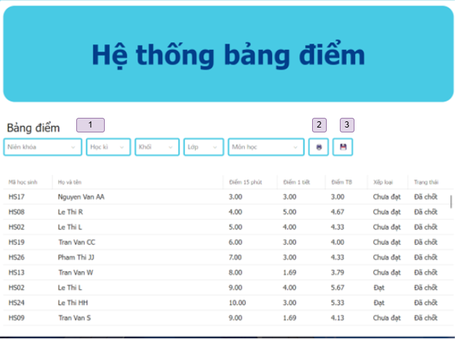 |
| :----------------------------------: |
| _Score System Management Screen_ |

1. Filter combobox.
2. Export to excel.
3. Save.

  
Subjects Managment

| 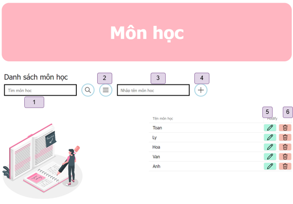 |
| :----------------------------------: |
| _Subjects Managment Screen_ |

1. Search subject.
2. Show all subject.
3. Enter new subject name.
4. Add new subject.
5. Edit subject.
6. Remove subject.

  
Achievements Managment

| 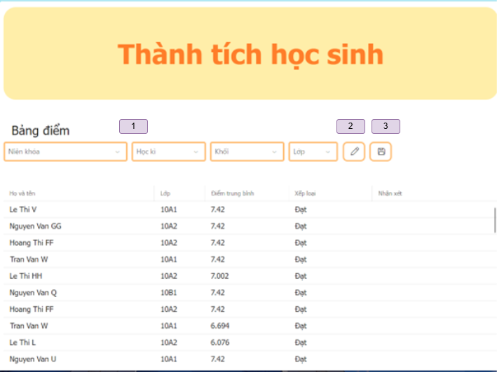 |
| :----------------------------------: |
| _Achievements Managment Screen_ |

1. Filter comboxbox.
2. Edit achievement.
3. Save achievement.

  
Assignments Managment

| 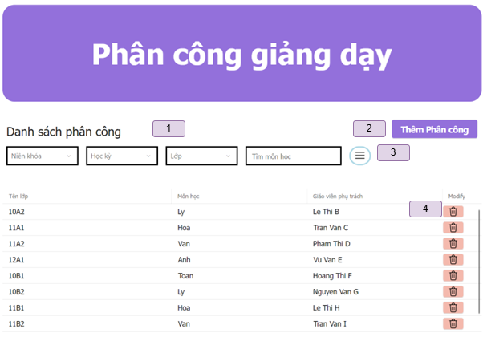 |
| :----------------------------------: |
| _Assignments Managment Screen_ |

1. Filter comboxbox.
2. Open add assignment screen.
3. Show all assignments.
4. Remove assignment.

  
Add Assignment

| 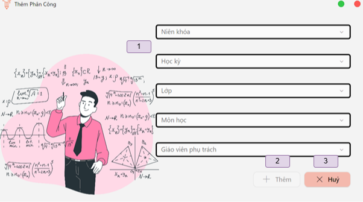 |
| :----------------------------------: |
| _Add new Assignment Screen_ |

1. Enter information.
2. Save.
3. Cancel.

  
Rules Managment

| 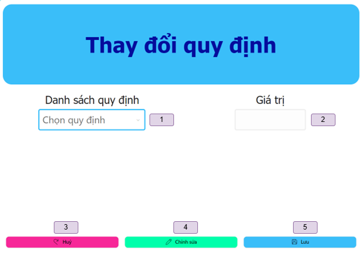 |
| :----------------------------------: |
| _Rules Managment Screen_ |

1. Select rule.
2. Enter value.
3. Undo changes.
4. Edit.
5. Save.

